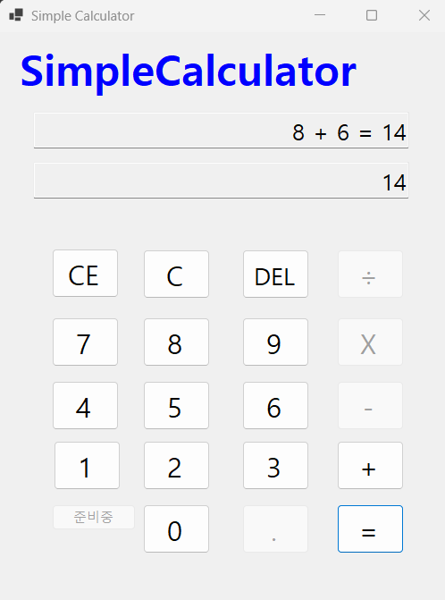

# (C# 코딩) Simple Calculator

## 개요
- C# 프로그래밍 학습
- 한줄소개 : 숫자입력을 받아 사칙연산을 수행하는 간단한 계산기 프로그램
- 핵심기능 : 숫자 입력, 연산자 입력, 결과 출력
- 사용한 플랫폼 : Visual Studio, C#, .NET Framework, GitHub
- 사용한 컨트롤 : TextBox, Button, Label
- 사용한 기술과 구현한 기능 :
  - C# 언어로 콘솔 애플리케이션 개발
  - 사용자 입력 처리 (숫자와 연산자)
  - 사칙연산 기능 구현 (덧셈, 뺄셈, 곱셈, 나눗셈)
  - 결과 출력 및 오류 처리 (예: 0으로 나누기)
  - del, c, ce 버튼 구현 (입력 초기화 및 마지막 입력 삭제)
  - ce 입력 시 피연산자가 없다면 전체 초기화, 있다면 마지막 피연산자 삭제
  - string으로 입력받고 int로 변환하여 계산 수행
  - int를 string으로 변환하여 결과 출력
  - 변환 시 파싱을 사용하여 입력값이 유효한 숫자인지 확인
  - 다항 연산자 처리

## 실행화면 (과제1)
- 과제 1 코드의 실행 스크린샷
- 
- 과제내용
  - 컨트롤 배치와 기본적인 속성 설정
  - 입력 내용을 2가지 방법으로 표시하는 기능 구현
  - 더하기 기능 구현
- 구현 내용과 기능 설명
  - 버튼 컨트롤을 사용하여 사용자로부터 숫자 입력 받음
  - 버튼 컨트롤을 사용하여 연산자 입력 받음
  - 텍스트박스 컨트롤을 사용하여 결과 출력
  - 입력된 숫자를 int로 변환하여 계산 수행
  - 계산 결과를 string으로 변환하여 텍스트박스 에 출력

## 실행화면 (과제2)
- 과제 2 코드의 실행 스크린샷
- .png)
  -곱셈을 실행한 화면
- .png)
  -0으로 나누었을 때 오류 메시지가 출력된 화면
- 과제내용
  - 빼기, 곱하기, 나누기 기능 구현
  - 각 버튼 클릭 시 연산자만 변경하여 동일 로직 구현
- 구현 내용과 기능 설명
  - 빼기, 곱하기, 나누기 기능을 추가하여 사칙연산 완성
  - 각 버튼 클릭 시 연산자만 변경하여 동일한 계산 로직을 재사용
  - 0으로 나누기 시 오류 메시지 출력하여 예외 처리 구현

## 실행화면 (과제3)
- 과제 3 코드의 실행 스크린샷
- .png)
  - 초기 화면
- .png)
  - DEL 버튼을 눌러 마지막 입력한 숫자만 삭제한 화면
- .png)
  - C 버튼을 눌러 모든 입력이 초기화된 화면
- 과제내용
  - 계산기에 있는 수정, 삭제기능 구현
  - C버튼 : 현재의 모든 내용을 삭제하고 초기화된 상태로 돌아감
  - CE버튼 : 마지막 입력한 숫자나 연산자를 삭제
  - del 버튼 : 마지막 입력한 숫자를 삭제
- 구현 내용과 기능 설명
  - C 버튼을 클릭하면 모든 입력이 초기화되어 계산기가 초기 상태로 돌아감
  - CE 버튼을 클릭하면 마지막 입력한 숫자나 연산자가 삭제되어 이전 상태로 돌아감
  - del 버튼을 클릭하면 마지막 입력한 숫자만 삭제되어 연산자는 유지됨
